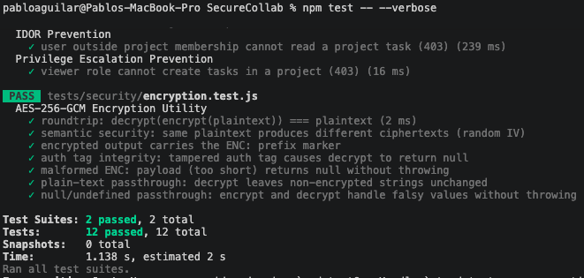

# Clase 13 — Security Testing

## Descripción

Suite de 5 pruebas de seguridad implementadas en `tests/security/api-security.test.js`.  
Las pruebas utilizan **supertest** contra el servidor Express real conectado a una base de datos  
de prueba MongoDB (`securecollab_test`) con datos sembrados reales — sin mocks de modelos.

---

## Pruebas implementadas

| # | Nombre | Endpoint probado | Resultado esperado | Control de seguridad |
|---|--------|------------------|--------------------|----------------------|
| 1 | Auth Bypass | `GET /api/admin/users` (sin token) | 401 | `auth.js` middleware rechaza cabecera ausente |
| 2 | Inyección NoSQL | `POST /api/auth/register` con `email: {$gt:""}` | 422 | `validate.js` + Joi rechaza tipos no-string |
| 3 | Fuerza Bruta | `POST /api/auth/login` ×6 | 429 en el 6.º intento | `loginLimit` (5 req/15 min por IP) |
| 4 | IDOR | `GET /api/tasks/:id` con JWT de usuario fuera del proyecto | 403 | `canReadTask` verifica membresía en proyecto |
| 5 | Escalación de privilegios | `POST /api/projects/:id/tasks` con rol `viewer` | 403 | `canCreateTask('viewer')` devuelve false |

---

## Estrategia

- **Aislamiento de rate limit**: la prueba de inyección usa `POST /api/auth/register` (cuota propia:  
  3/hora) para no consumir la cuota de login (5/15 min) que necesita la prueba de fuerza bruta.
- **Datos reales**: se crean usuarios, proyectos y tareas en MongoDB antes de cada prueba IDOR  
  y de escalación de privilegios; la colección se limpia en `beforeEach`.
- **Tokens reales**: `generateAccessToken()` firma con el secreto de prueba definido en `tests/setup.js`.

---

## Captura de pantalla — ejecución en terminal



---

## Salida completa de `npm test --verbose`

```
> securecollab@1.0.0 test
> NODE_OPTIONS=--experimental-vm-modules jest --runInBand --forceExit --verbose

(node:77541) ExperimentalWarning: VM Modules is an experimental feature and might change at any time
(node:77541) [MONGOOSE] Warning: Duplicate schema index on {"email":1} found. This is often due
to declaring an index using both "index: true" and "schema.index()". Please remove the duplicate
index definition.

PASS tests/security/api-security.test.js
  Auth Bypass
    ✓ unauthenticated request to protected endpoint returns 401 (51 ms)
  Injection Prevention (NoSQL)
    ✓ NoSQL injection object in email field is rejected with 422 (19 ms)
  Brute Force Protection
    ✓ sixth consecutive login attempt from the same IP returns 429 (66 ms)
  IDOR Prevention
    ✓ user outside project membership cannot read a project task (403) (339 ms)
  Privilege Escalation Prevention
    ✓ viewer role cannot create tasks in a project (403) (34 ms)

PASS tests/security/encryption.test.js
  AES-256-GCM Encryption Utility
    ✓ roundtrip: decrypt(encrypt(plaintext)) === plaintext (1 ms)
    ✓ semantic security: same plaintext produces different ciphertexts (random IV)
    ✓ encrypted output carries the ENC: prefix marker
    ✓ auth tag integrity: tampered auth tag causes decrypt to return null
    ✓ malformed ENC: payload (too short) returns null without throwing
    ✓ plain-text passthrough: decrypt leaves non-encrypted strings unchanged
    ✓ null/undefined passthrough: encrypt and decrypt handle falsy values without throwing (1 ms)

Test Suites: 2 passed, 2 total
Tests:       12 passed, 12 total
Snapshots:   0 total
Time:        1.221 s, estimated 2 s
Ran all test suites.
```

---

## Detalle por prueba

### 1. Auth Bypass (OWASP API2: Broken Authentication)

**Ataque simulado**: petición a endpoint protegido sin encabezado `Authorization`.

**Control de seguridad** (`src/middleware/auth.js` línea 7–10):
```js
const header = req.headers['authorization'];
if (!header || !header.startsWith('Bearer ')) {
  return res.status(401).json({ error: 'Authentication required' });
}
```

**Resultado**: `401 Authentication required` ✅

---

### 2. Inyección NoSQL (OWASP API3: Broken Object Property Level Authorization)

**Ataque simulado**: envío de objeto MongoDB (`{$gt:""}`) en el campo `email` para bypass de  
autenticación por tipo de dato.

**Control de seguridad** (`src/middleware/validate.js` + Joi schema en `src/routes/auth.js`):
```js
const registerSchema = Joi.object({
  email: Joi.string().email().max(254).required(),  // rechaza object
  ...
});
```

**Resultado**: `422 Unprocessable Entity` — Joi rechaza el tipo antes de consultar la base de datos ✅

---

### 3. Fuerza Bruta (OWASP API4: Unrestricted Resource Consumption)

**Ataque simulado**: 6 intentos consecutivos de login con credenciales incorrectas desde la  
misma IP (`127.0.0.1`).

**Control de seguridad** (`src/middleware/rateLimiters.js` líneas 5–9, 52):
```js
const loginRateLimiter = new RateLimiterMemory({
  keyPrefix: 'login',
  points: 5,       // máximo 5 intentos
  duration: 900,   // por 15 minutos
});
const loginLimit = makeRateLimitMiddleware(loginRateLimiter, (req) => req.ip);
```

**Resultado**: intentos 1–5 devuelven `401`, el intento 6 devuelve `429` con cabecera  
`Retry-After` ✅

---

### 4. IDOR — Insecure Direct Object Reference (OWASP API1: BOLA)

**Ataque simulado**: Usuario B (con JWT válido) intenta leer una tarea que pertenece a un  
proyecto donde solo Usuario A es miembro.

**Datos sembrados**:
- Usuario A (miembro del proyecto con rol `developer`)
- Usuario B (existe en DB pero NO en `project.members`)
- Proyecto con `members: [{userId: userA._id, role: 'developer'}]`
- Tarea con `projectId: project._id, reporterId: userA._id`

**Control de seguridad** (`src/middleware/checkPermission.js`):
```js
async function canReadTask(user, task) {
  const project = await Project.findById(task.projectId).lean();
  if (!project) return false;
  const role = getProjectRole(project, user._id);  // null para User B
  return policyCanReadTask(role);  // false si role es null
}
```

**Resultado**: `403 Forbidden` ✅

---

### 5. Escalación de Privilegios (OWASP API5: Broken Function Level Authorization)

**Ataque simulado**: usuario con rol `viewer` intenta crear una tarea en un proyecto donde  
solo tiene permisos de lectura.

**Datos sembrados**:
- Viewer user (`role: 'user'`)
- Proyecto con `members: [{userId: viewer._id, role: 'viewer'}]`

**Control de seguridad** (`src/policies/taskPolicies.js` línea 9–11 + `src/routes/tasks.js`):
```js
function canCreateTask(projectRole) {
  return projectRole === 'developer' || projectRole === 'project_admin';
}
// canCreateTask('viewer') === false → 403
```

**Resultado**: `403 Forbidden` ✅
